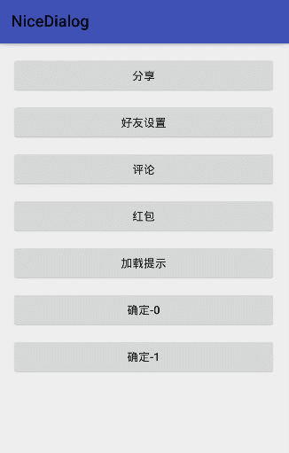
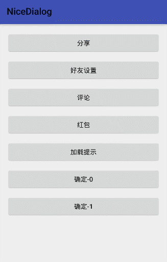

# NiceDialog

### 简介：
* 基于DialogFragment的扩展，让dialog的使用更方便
* 原理：<http://www.jianshu.com/p/0529433d4522>
### 示例预览：

||||
|---|---|---|
||||

### 基本用法：
**Step 1. 添加JitPack仓库**

在当前项目根目录下的 `build.gradle` 文件中添加如下内容:
``` gradle
allprojects {
    repositories {
        ...
        maven { url "https://jitpack.io" }
    }
}
```
**Step 2. 添加项目依赖**
``` gradle
dependencies {
        implementation 'com.github.SheHuan:NiceDialog:1.2.0'
}
```
**Step 3. 配置、展示dialog**
```java
NiceDialog.init()
          .setLayoutId(R.layout.dialog)     //设置dialog布局文件
          .setTheme(R.style.MyDialog) // 设置dialog主题，默认主题继承自Theme.AppCompat.Light.Dialog
          .setConvertListener(new ViewConvertListener() {     //进行相关View操作的回调
              @Override
              public void convertView(ViewHolder holder, final BaseNiceDialog dialog) {

              }
          })
          .setDimAmount(0.3f)     //调节灰色背景透明度[0-1]，默认0.5f
          .setGravity()     //可选，设置dialog的位置，默认居中，可通过系统Gravity的类的常量修改，例如Gravity.BOTTOM（底部），Gravity.Right（右边），Gravity.BOTTOM|Gravity.Right（右下）
          .setMargin()     //dialog左右两边到屏幕边缘的距离（单位：dp），默认0dp
          .setWidth()     //dialog宽度（单位：dp），默认为屏幕宽度，-1代表WRAP_CONTENT
          .setHeight()     //dialog高度（单位：dp），默认为WRAP_CONTENT
          .setOutCancel(false)     //点击dialog外是否可取消，默认true
          .setAnimStyle(R.style.EnterExitAnimation)     //设置dialog进入、退出的自定义动画；根据设置的Gravity，默认提供了左、上、右、下位置进入退出的动画
          .show(getSupportFragmentManager());     //显示dialog
```
**注意:** `setMargin()`和`setWidth()`选择一个即可

### 更多用法：
##### 1、创建一个继承BaseNiceDialog的类，如果需要传参可仿照如下方式，也是就是常用的Fragment传参方式
```java
public class ConfirmDialog extends BaseNiceDialog {
        private String type;

        public static ConfirmDialog newInstance(String type) {
            Bundle bundle = new Bundle();
            bundle.putString("type", type);
            ConfirmDialog dialog = new ConfirmDialog();
            dialog.setArguments(bundle);
            return dialog;
        }

        @Override
        public void onCreate(@Nullable Bundle savedInstanceState) {
            super.onCreate(savedInstanceState);
            Bundle bundle = getArguments();
            type = bundle.getString("type");
        }

        @Override
        public int intLayoutId() {
            return R.layout.dialog;
        }

        @Override
        public void convertView(ViewHolder holder, final BaseNiceDialog dialog) {

        }
    }
```
##### 2、展示dialog
```java
ConfirmDialog.newInstance("1")
             .setMargin(60)
             .setOutCancel(false)
             .show(getSupportFragmentManager());
```
